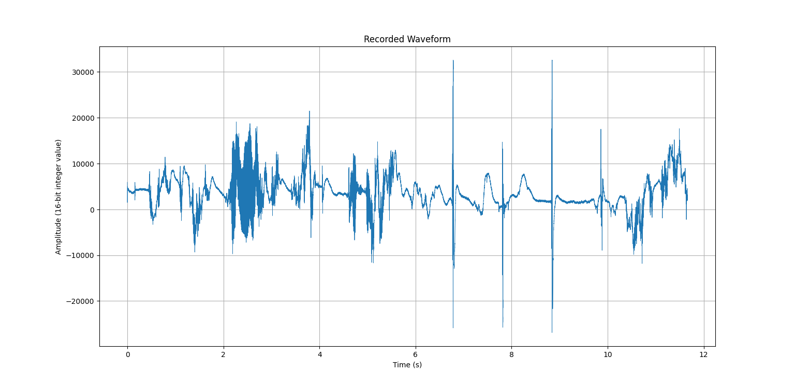

[Home](../../index.md) / [Engineering](index.md) /

# Analogue to Digital Voice Recorder

The analogue to digital voice recorder is an extended university project, where the input conditioning circuit for a microphone is designed for specific filter characters, namely requiring a reasonable gain and an anti-aliasing filter to attenuate fully for 8 bits. The project was extended to include the digital recording by sampling the output voltage using an Arduino’s input pins, in which the sampled voltage was sent through serial to a python script. Serial transfer is required, as the Arduino has too small memory to properly store a sizeable audio recording.

The design report highlighting the circuit design process is can be viewed through this pdf: [report.pdf](./report.pdf). It is only relevant to the design of the circuit, in regards to a different microcontroller, and so is not necessary to understand the project.

## Data Sampling

The data is retrieved on the Arduino itself, through an input pin. The data is sampled through an interrupt, and sent when a flag is set across the serial.

The following code block demonstrates the interrupt used to sample the voltage, where it is configured to use prescaler 64, free running mode, at 19230Hz. The code uses two buffers, so that the program does not stall and skip samples when sending the package across serial.
```C
// ADC interup, running at 19230Hz independent to the main loop
ISR(ADC_vect) {
  static uint16_t index = 0;
  static int skip = 0;

  if(++skip < skipInterval) return; // skip samples
  skip = 0;

  uint16_t sample = ADC; // get the input value

  if(fillingA)
    bufferA[index] = sample;
  else
    bufferB[index] = sample;

  index++;

  // once the buffer is filled, let the main loop know it is ready to send. Then, start filling the other buffer
  if(index >= BUFFER_SIZE) {
    index = 0;
    blockReady = true;
    readyBlock = fillingA ? bufferA : bufferB;
    fillingA = !fillingA;
  }
}
```

The following code block demonstrates how the data is sent through serial. Each package is sent after heading, since a start/stop command is also sent through the network, and so the heading lets the code know not to interpret the following data as a command.
```C
void sendHeader(uint8_t type) {
  // send two known signals, to make the reciever less prone to stopping during the data logging
  Serial.write(0xAA);
  Serial.write(0x55);
  // send the package type
  Serial.write(type);
}

void sendSamples() {
  if (blockReady) {
    blockReady = false;

    sendHeader(0x03);  // DATA packet

    // send the length of the data
    uint16_t byteCount = BUFFER_SIZE * 2;
    Serial.write(byteCount & 0xFF);
    Serial.write(byteCount >> 8);

    // send the data
    for (int i = 0; i < BUFFER_SIZE; i++) {
      uint16_t s = readyBlock[i];
      Serial.write(s & 0xFF);
      Serial.write(s >> 8);
    }
  }
}
```

## Data Processing

The data sent through the serial is monitored using a python script and stored, to output to a wav file after the stop command is retrieved. The code functions through an endless loop, where it first waits for a packet to be recieved (start, stop, or data). If the type is data, it then reads enough bytes specified by the heading and converts it into 16-bit signed integers. The output is conditioned to centre around 0, required to reconstruct a proper waveform since the signal data has a DC bias.

This process has two important functions, to wait for a packet, and to read a set number of bytes from the stream. The code for these sections are given in the code block:

```Python
def read_bytes_from_stream(ser: serial.Serial, n : int):
    """
    Repeated read from the serial port until n bytes have been retrieved

    Args:
        ser (serial.Serial object): serial port, where the data is read from
        n (integer): number of bytes to read for
    
    Returns:
        exactly n bytes from the serial port
    """
    data = b''
    while len(data) < n:
        chunk = ser.read(n - len(data))
        if not chunk:
            raise RuntimeError("Serial timeout")
        data += chunk
    return data

def wait_for_packet(ser : serial.Serial):
    """
    Scan the serial port until the unique 2-byte header is recieved, specifying a new packet of data has been retrieved
    Args:
        ser (serial.Serial object): serial port, where the data is read from
    """
    while True:
        b1 = ser.read(1)
        if not b1 or b1[0] != SYNC1:
            continue
    
        b2 = ser.read(1) # this is not the same as b1, since ser.read consumes one byte

        # break out of the loop once both bytes have been read in succession (first byte passes throught the first continue, and this checks the second byte)
        if b2 and b2[0] == SYNC2:
            return  

```

An example output audio waveform is shown in the following figure, where the .wav file correctly output the voice spoken into the microphone. The recorded waveform contains some noise, mainly due to the chebyshev filter ripple. The clipping was done through the code, not from the microphone output, just to give audio that is safe to listen to. The audio will not be attached here, as I do not want my voice public.




