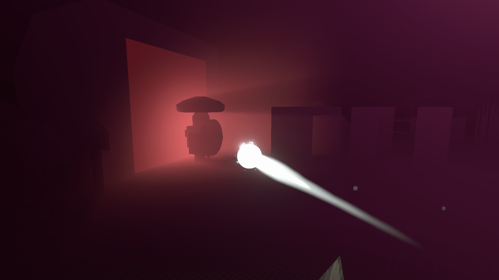
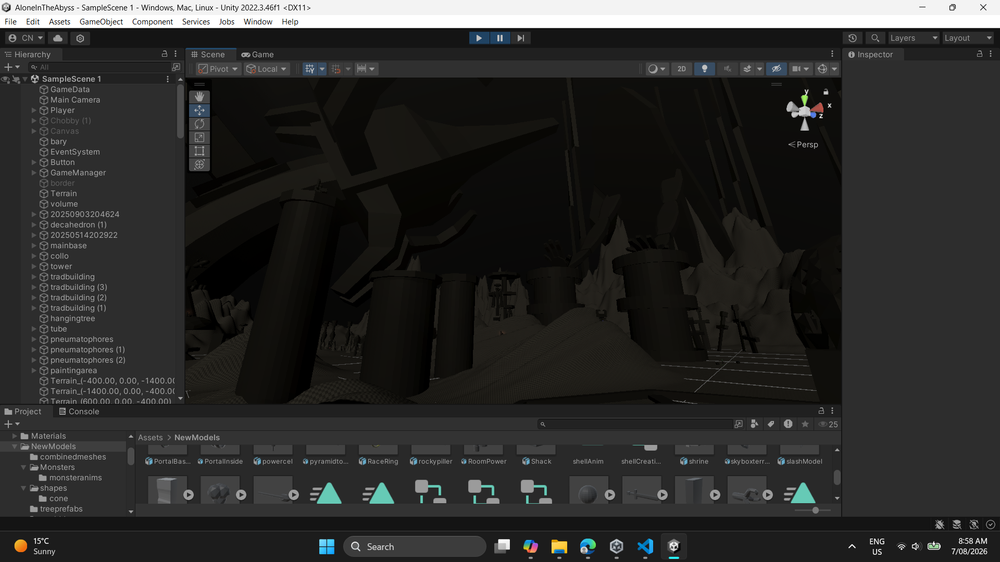

[Home](../../../index.md) / [Game Development](../index.md) / [Games](games.md) /

# Foglights

Fog lights is a third person 3D atmospheric horror story game, where the player controls an orb of light to defeat large, greyscale monsters. This game was created to furher develope my environmental storytelling skills.

The game was published in June 24th, 2026.

<iframe frameborder="0" src="https://itch.io/embed/4700793" width="552" height="167"><a href="https://nimclay.itch.io/foglights">FogLights by nimclay</a></iframe>



## Story

The main avenue for this story telling is through a combination of the creature design, and the volumetric fog to hide and accentuate certain features. The player progresses through the game by defeating a set of monsters, where the user continously returns to the starting position after fading to white.


After each reset, the world updates to add the new creature to face, and an external much larger creature or object. The secondary creature is the main driver for the horror, attempting to invoke a sense of megalophobia.



Throughout the world are journal entries following the story of two scientists, increasing the mystery of the world and filling the map with more of a reason for exploration. This makes the game more interactive, whilst deepening the lore. The lore entries are stored as a set of txt files, stored specifically in the StreamingAssets folder. They have to be inside this folder to be loaded in runtime. The entries were loaded using the following code:

```C#
string path = Path.Combine(Application.streamingAssetsPath, fileName);

string journal;

try{
    journal = File.ReadAllText(path);
}
catch{
    journal = "error: journal not found";
}

text.font = font;
text.text = journal;
```

Halfway through the game, the music changes to something more chaotic, serving as a turning point in the story. This change, and the climax of the game, can only be fully understood by reading all of the journal entries.

Another subtle storytelling detail is where after completing each phase, the camera moves slightly closer to the enemy. This is to forshadow the ending, where instead of the player being the orb, they are instead only observing it.

