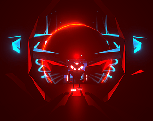
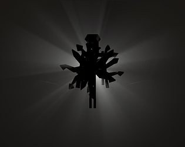
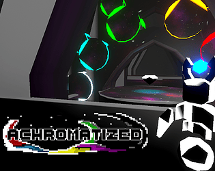
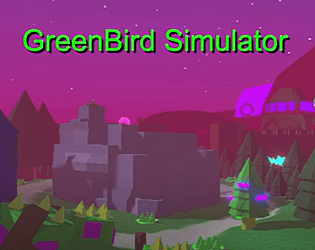
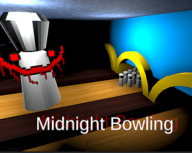
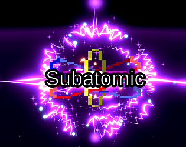
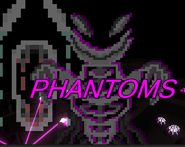

[Home](../../../index.md) / [Game Development](../index.md) /

### Games

I have published several games to my itch.io [profile](https://nimclay.itch.io/) across eight years of development in the Unity engine. I aimed to tailor each project to developing a few core skills.

<table class="table-card">
  <tr>
    <td>
      <strong>Rebirth of the Forsaken:</strong> 
      A large open world 3D platformer with rougelite elements. The player must balance raising and protecting children with exploring, growing stronger, and defeating the governing deities. The game has approximately 25 hours of content to experience everything fully.
      
    <a href="rebirthoftheforsaken.html">More details</a>
    </td>
    <td class="table-card-side">
        
    </td>
  </tr>
</table>

<table class="table-card">
  <tr>
    <td>
      <strong>FogLights:</strong> 
      A third person atmospheric horror experience targeting megalophobia, making use of volumetric fog lighting to silhouette large monsters. The game is made on top of the code for Subatomic, making use of the fully 3D character movement. This game was made with the purpose to expand my skills storytelling and game progression, while having a clear objective and an ending.
      
    <a href="foglights.html">More details</a>
    </td>
    <td class="table-card-side">
        
    </td>
  </tr>
</table>

<table class="table-card">
  <tr>
    <td>
      <strong>Achromatized:</strong> 
      A third person shooter where you steal the colour from randomly spawned rooms (not procedurally generated).
      
    <a href="achromatized.html">More details</a>
    </td>
    <td class="table-card-side">
        
    </td>
  </tr>
</table>

<table class="table-card">
  <tr>
    <td>
      <strong>Greenbird Simulator:</strong> 
      My first major game. It is a third person semi-open world platformer where you try to raise children for as possible. The game has two main levels, and several unlockable level variations. It also includes dozens of linear levels, with hidden unlockable skins and powerups. This game is my first main experience working on a large project, letting me see first hand how poor coding practices build over time. The source code is made public, but does not represent my current programming skills (it is just to give context on how many files I have to work across): https://github.com/claynimmo/GreenBird-Simulator-Source-Code. This does not include the level design, modelling, animations, music, shaders etc, so this only represents about 15% of the total work that went into the game.
      
    <a href="greenbirdsim.html">More details (WIP)</a>
    </td>
    <td class="table-card-side">
        
    </td>
  </tr>
</table>

<table class="table-card">
  <tr>
    <td>
      <strong>Midnight Bowling:</strong> 
      a short horror game where you go bowling at midnight. The game is poorly polished, and was only made in about 3 days, and yet is somehow my most popular game gaining 10x the amount of players of every other game.
      
    <strong>Midnight Bowling Last Strike:</strong> 
    A sequal to midnight bowling, where it goes across various locations instead of just one. I made this game to write my wrongs from the first game, since at the time, I felt the previous game's popularity was unearned due to pushing the game out quickly for my friends with little quality control.
      
    <a href="midnightbowling.html">More details (WIP)</a>
    </td>
    <td class="table-card-side">
        
    </td>
  </tr>
</table>

<table class="table-card">
  <tr>
    <td>
      <strong>Subatomic:</strong> 
      A small scale team-based battle royal type game, where you control one atom and use your abilities to destroy the opposing team's atoms.
      
    <a href="subatomic.html">More details</a>
    </td>
    <td class="table-card-side">
        
    </td>
  </tr>
</table>

<table class="table-card">
  <tr>
    <td>
      <strong>Phantoms:</strong> 
      A short horror game where the enemies play into both the sound and light mechanics of first person horror games. I made this game as an introduction to procedural generation.
      
    <a href="phantoms.html">More details (WIP)</a>
    </td>
    <td class="table-card-side">
        
    </td>
  </tr>
</table>
