[Home](../../../index.md) / [Game Development](../index.md) / [Games](games.md) /

# Rebirth of the Forsaken

A large open world 3D platformer with rougelite elements. The player must balance raising and protecting children with exploring, growing stronger, and defeating the governing deities. The game has approximately 25 hours of content to experience everything fully.

The game was published on March 15th, 2026

<iframe frameborder="0" src="https://itch.io/embed/4067635" width="552" height="167"><a href="https://nimclay.itch.io/rebirth-of-the-forsaken">Rebirth of the Forsaken by nimclay</a></iframe>

This is my highest quality game, that represents my skills the best. It is a sequel to [Greenbird Simulator](greenbirdsim.md), where it has improved visuals, level design, mechanics, optimisation, and the addition of boss fights and a proper combat system. I have supported this game with several post launch updates to improve the game with new features and bug fixes, based on user feedback. The project is too large to curate the source code and make public, but I have published sections of the code into importable packages for both the [UI](../packages/customuipackage.md) and the [3D platformer mechanics](../packages/3dplatformerpackage.md)

<iframe width="560" height="315" src="https://www.youtube.com/embed/D6iHg3Dvbyg?si=NHW1kIl-mLMGY43t" title="YouTube video player" frameborder="0" allow="accelerometer; clipboard-write; encrypted-media; gyroscope; picture-in-picture; web-share" referrerpolicy="strict-origin-when-cross-origin" allowfullscreen></iframe>

## Demonstrated Skills

The game demonstrates skills in:

- optimizing large open worlds with a significant number of rendered objects
- creating animations and state machines for the movement and combat systems
- managing dynamic memory through the instantiation, destroy, and limits when spawning the hoards of enemies during the raids
- level and art design, through the several unique locations oriented logically
- music composition for the variety of locations
- object oriented design principles, through the extendable buff system and reward structure
- UI and UX design, composing the menus to be keyboard navigable, and easy to follow
- Scope and project management, having released the game in a full, feature complete, state with a large amount of content without abandoning the project.
- designing shaders and fullscreen effects to enhance the game feel
- project organisation, managing the locations of thousands of scripts, materials, models, etc.

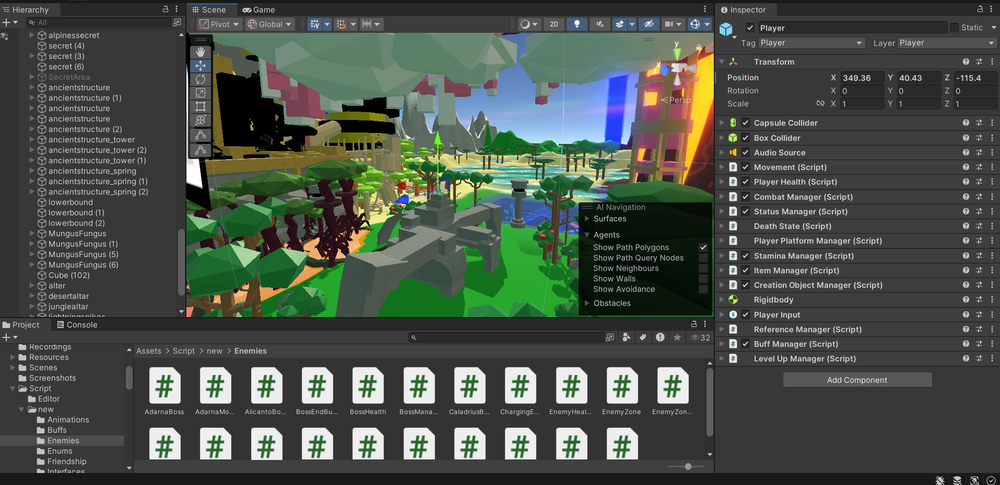

## Music

As a crucial part of game feel, I have composed 13 different music tracks for the game. I used the free LMMS software to compose the tracks, making use of various effects and layering instruments to create simple, yet effective, sounds for my game. The full soundtrack, excluding the newer tracks added in updates, is uploaded to my youtube channel. My personal favourite track is the Sky Palace.

<iframe width="560" height="315" src="https://www.youtube.com/embed/Pci5J7z0klY?si=BYIP80zEggAoIq5j" title="YouTube video player" frameborder="0" allow="accelerometer; clipboard-write; encrypted-media; gyroscope; picture-in-picture; web-share" referrerpolicy="strict-origin-when-cross-origin" allowfullscreen></iframe>

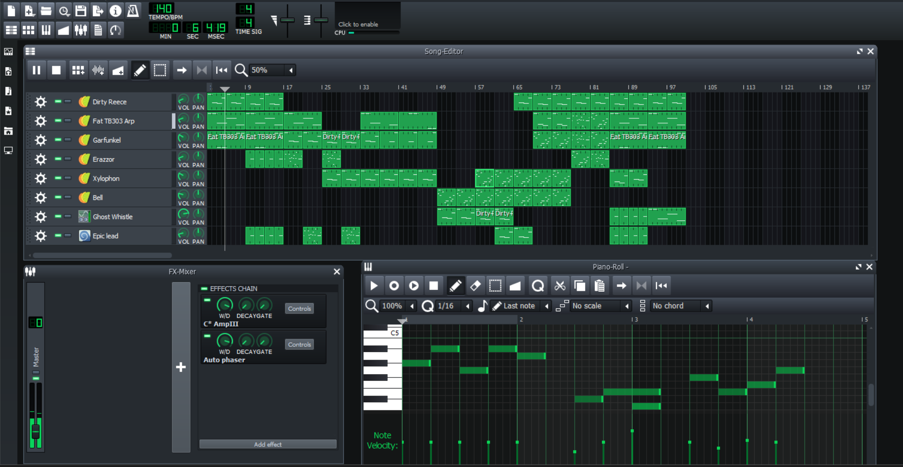

## Shaders

The game was developed targeting the Universal Render Pipeline, due to its compatibility with shader graph and the ability to use full screen render features. I have created a water, edge pulse, tornado, aurora, scrolling texture, screen tint, screen vignette, and a world tiling shader. The shaders were created using shadergraph, as learning the hlsl language is too time consuming. The world tiling shader was originally written in hlsl before being converted to shadergraph, so it could more easily inherit the lighting and shadow render settings.

  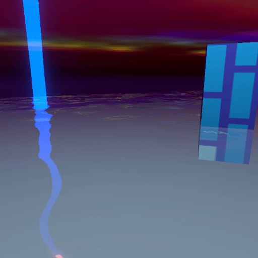
  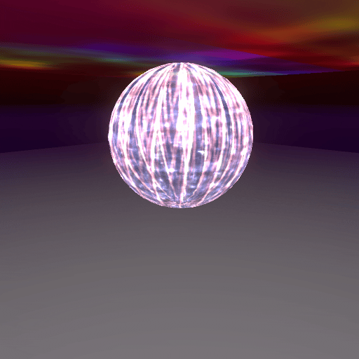
  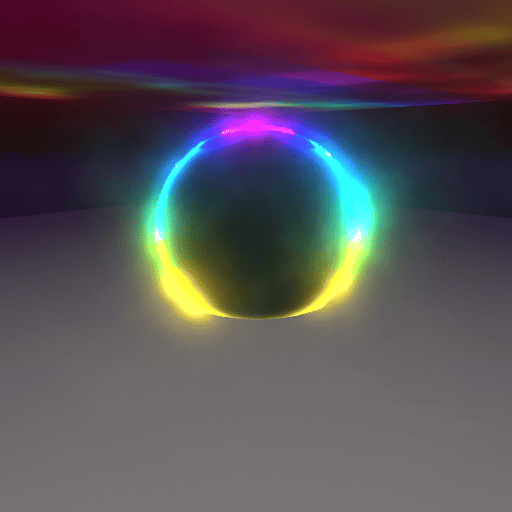
  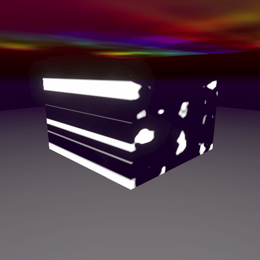
  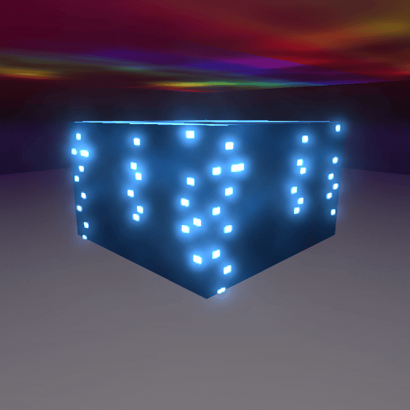
  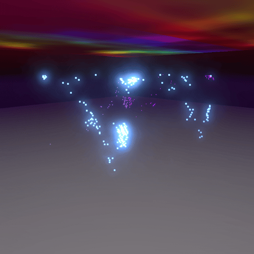
  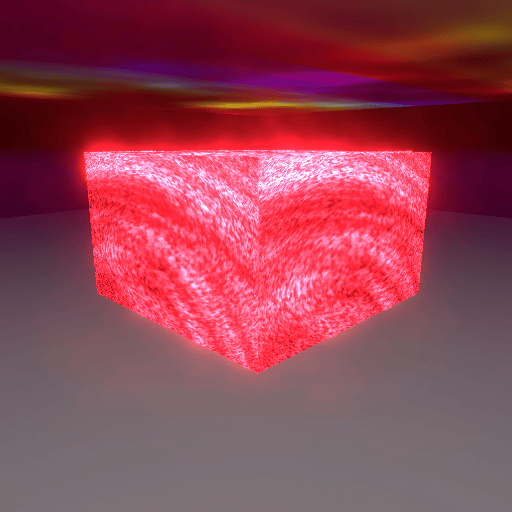
  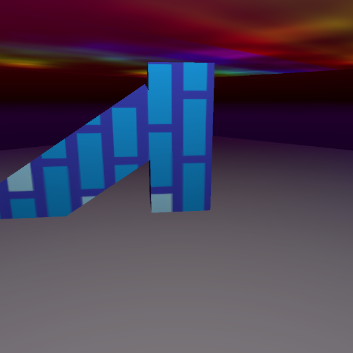

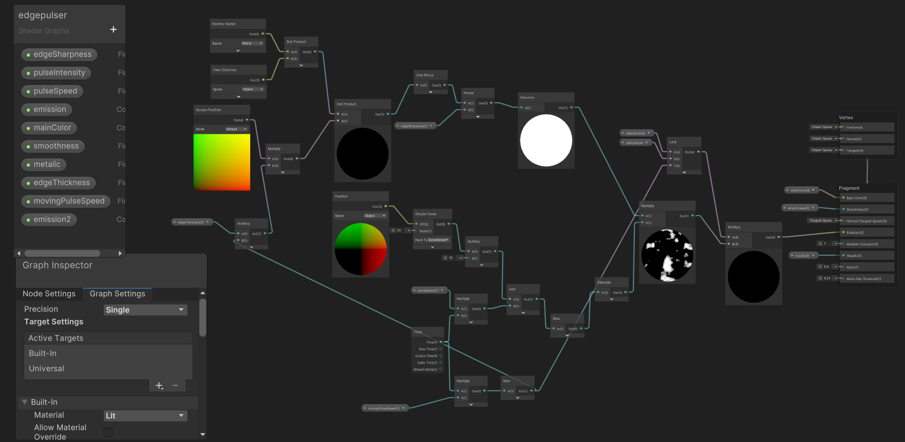

## Post Launch Updates

The game was supported with two major post launch updates adding a large number of features, and addressing some user feedback. The updates were given change logs:

- [Version 1.1.0](https://nimclay.itch.io/rebirth-of-the-forsaken/devlog/1309756/rebirth-of-the-forsaken-v110-patch-notes)
- [Version 1.2.0](https://nimclay.itch.io/rebirth-of-the-forsaken/devlog/1458525/rebirth-of-the-forsaken-v120-patch-notes)

