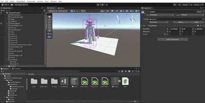
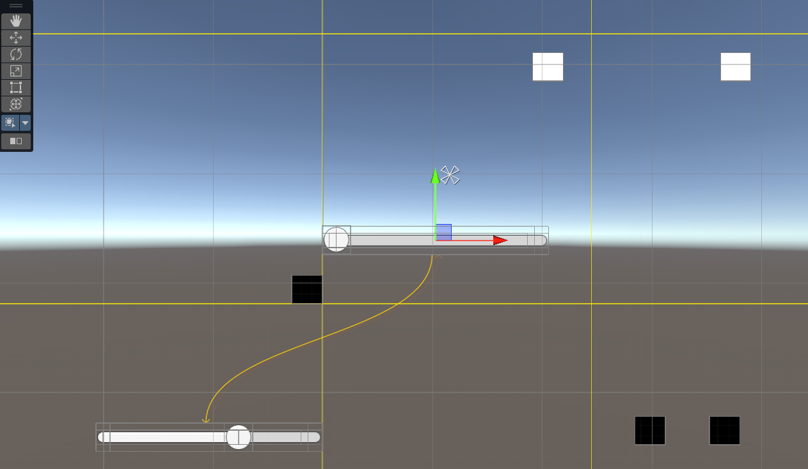
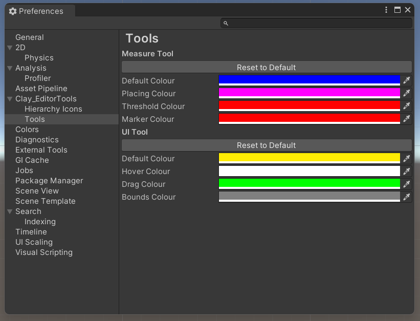

[Home](../../../index.md) / [Game Development](../index.md) / [Packages](packages.md) /

# Editor Tools

The editor tools package was made to create a set of tools to streamline common problems I have faced while developing games, such as aligning UI elements, duplicating object with pixel perfect spacing, or slightly altering the transform to avoid overlapping UVs.

The package can be imported into unity by pasting the following link in package manager, following this [guide](packageguide.md)

```
https://github.com/claynimmo/Unity-Editor-Tools-Package.git
```

The package has several tools, including toolbar tools, window functions, heirarchy methods, etc. The full documentation is available in the README.md file in the github repository, so to avoid repeating, this document will only showcase the highlights

## Neighbor Tool

The duplicate tool appears around the bounds of the selected object, that duplicates and snaps the object to the face of the selected gizmo. This tool perfectly aligns the objects, such that there leaves no gap, and minimal overlap.



### How the tool works

The tool inherits from EditorTool to perform actions on the currently selected object in the editor, given the tool is selected. It uses the OnToolGUI handle as the entry point:

```C#
public override void OnToolGUI(EditorWindow window){
    if (!Selection.activeTransform) return; // do nothing if no object is selected

    // set the color to something visible, but different to the default selection and colliders
    Color c;
    ColorUtility.TryParseHtmlString("#ff00e6", out c);
    Handles.color = c;

    DrawPerChildBounds(Selection.activeTransform);
}
```

The draw bounds function works by using the built in MeshFilter component, where it loops over every filter on itself and its children, to get the bounds by calling MeshFilter.bounds. These bounds are then mapped into Vector3 coordinates so that editor lines can be drawn between them. Additionally, the bounds are used to compute faces, in which an arrow facing outward from the face is added:

```C#
void DrawPerChildBounds(Transform root){
    MeshFilter[] filters = root.GetComponentsInChildren<MeshFilter>();

    foreach (var mf in filters){
        if (!mf.sharedMesh) continue;

        Mesh mesh = mf.sharedMesh;
        Bounds b = mesh.bounds;

        // 8 local corners
        /* indexes correspond to these vertices (front face is closest, top is the top)
              7 ---------- 6
             /|           /|
            3 ---------- 2 |
            | |          | |
            | 4 ---------|-5
            |/           |/
            0 ---------- 1
        */
        Vector3[] c = new Vector3[8];
        c[0] = new Vector3(b.min.x, b.min.y, b.min.z);
        c[1] = new Vector3(b.max.x, b.min.y, b.min.z);
        c[2] = new Vector3(b.max.x, b.max.y, b.min.z);
        c[3] = new Vector3(b.min.x, b.max.y, b.min.z);
        c[4] = new Vector3(b.min.x, b.min.y, b.max.z);
        c[5] = new Vector3(b.max.x, b.min.y, b.max.z);
        c[6] = new Vector3(b.max.x, b.max.y, b.max.z);
        c[7] = new Vector3(b.min.x, b.max.y, b.max.z);

        // to world
            for (int i = 0; i < 8; i++)
            c[i] = mf.transform.TransformPoint(c[i]);

        // edges
        Handles.DrawLine(c[0], c[1]);
        Handles.DrawLine(c[1], c[2]);
        Handles.DrawLine(c[2], c[3]);
        Handles.DrawLine(c[3], c[0]);

        Handles.DrawLine(c[4], c[5]);
        Handles.DrawLine(c[5], c[6]);
        Handles.DrawLine(c[6], c[7]);
        Handles.DrawLine(c[7], c[4]);

        Handles.DrawLine(c[0], c[4]);
        Handles.DrawLine(c[1], c[5]);
        Handles.DrawLine(c[2], c[6]);
        Handles.DrawLine(c[3], c[7]);

        // faces
        Vector3[][] faces = new Vector3[][]
        {
            new [] { c[0], c[1], c[2], c[3] }, // front
            new [] { c[4], c[5], c[6], c[7] }, // back
            new [] { c[0], c[1], c[5], c[4] }, // bottom
            new [] { c[3], c[2], c[6], c[7] }, // top
            new [] { c[0], c[3], c[7], c[4] }, // left
            new [] { c[1], c[2], c[6], c[5] }  // right
        };
        
        // add arrows to each face, allowing the neighbouring
        foreach(var face in faces){
            DrawFaceArrow(face, c,root,mf.gameObject.transform);
        }
    }
}
```

The draw face arrow function includes the event handler for when it is clicked, where it computes the depth along the face normal to set the position of the cloned object. The cloned object is then registered into undo, otherwise the action cannot be reverse:

```C#
 void DrawFaceArrow(Vector3[] face, Vector3[] allCorners, Transform root, Transform currentObject){
    // face center (sum all corners, and divide by 4)
    Vector3 center = (face[0] + face[1] + face[2] + face[3]) / 4;

    // face normal
    Vector3 normal = Vector3.Cross(face[1] - face[0], face[3] - face[0]).normalized;
    Vector3 toRoot = (center - currentObject.position).normalized;

    if (normal == Vector3.zero)
        return;

    // ensure outward direction relative to root
    if(Vector3.Dot(normal, center - root.position) < 0)
        normal = -normal;

    float size = HandleUtility.GetHandleSize(center) * 0.4f;

    if(Handles.Button(center,Quaternion.LookRotation(normal),size,size,Handles.ArrowHandleCap)){
        float thickness = ComputeThicknessAlongNormal(allCorners, normal);
        DuplicateAndSnap(root, normal, thickness);
    }
}

// thickness determines how to position the duplicate
float ComputeThicknessAlongNormal(Vector3[] corners, Vector3 normal){
    float minProj = float.MaxValue;
    float maxProj = float.MinValue;

    for(int i = 0; i < corners.Length; i++){
        float p = Vector3.Dot(corners[i], normal); // project the corner onto the normal
        if (p < minProj) minProj = p;
        if (p > maxProj) maxProj = p;
    }

    // depth along face normal is the max projection of the 8 corners onto that face normal, minus the minimum projection
    return maxProj - minProj;
}

void DuplicateAndSnap(Transform original, Vector3 normal, float thickness){
    Transform clone = Object.Instantiate(original.gameObject).transform;
    Undo.RegisterCreatedObjectUndo(clone.gameObject, "Duplicate Neighbor");
    clone.name = original.name; // overide the name to avoid having (clone)(clone)(clone)... for consecutive duplications

    clone.position = original.position + normal * thickness;
    clone.SetParent(original.parent);
    Selection.activeTransform = clone;
}
```
## UI Positioning Tool

The UI positioning tool automatically sets the screen view into 2D mode, showing the canvas, and giving the default movement gizmo to any selected rect transform. It has 4 lines that are used to snap to the visible bounds of all other rect transforms. The style of the tool can also be customized, to give improved user experience



### How the tool works

The positioning tool uses the bounds of all enabled rect transforms in the canvas, by getting its 4 corners through RectTransform.GetWorldCorners. The snapping works simply by taking the distance from the corners to the guideline, and snapping if it is close enough:

```C#
Vector3[] corners = new Vector3[4];
rt.GetWorldCorners(corners);

for (int i = 0; i < 4; i++)
    corners[i] = canvas.InverseTransformPoint(corners[i]);

float left   = corners[0].x;
float right  = corners[2].x;
float top    = corners[1].y;
float bottom = corners[0].y;

Vector3 localPivot = canvas.InverseTransformPoint(rt.position);

float snappedX = localPivot.x;
float snappedY = localPivot.y;

float snapThreshold = 6f;

foreach (var line in lines){
    if(line.orientation == GuideLine.Orientation.Vertical){
        float distLeft  = Mathf.Abs(left  - line.position);
        float distRight = Mathf.Abs(right - line.position);

        if(distLeft < snapThreshold || distRight < snapThreshold){
            float target = distLeft < distRight ? left : right;
            float delta  = line.position - target;
            snappedX += delta;
        }
    }
    else{
        float distTop    = Mathf.Abs(top    - line.position);
        float distBottom = Mathf.Abs(bottom - line.position);

        if(distTop < snapThreshold || distBottom < snapThreshold){
            float target = distTop < distBottom ? top : bottom;
            float delta  = line.position - target;
            snappedY += delta;
        }
    }
}

Vector3 snappedWorld = canvas.TransformPoint(
    new Vector3(snappedX, snappedY, localPivot.z)
);

Undo.RecordObject(rt, "Snap UI Element To Guide Lines");
rt.position = snappedWorld;
```

Since both the snapping and movement write to the same value, to avoid jittering the snapping is applied after the EndChangeCheck function is called, so if the object is close enough to the guidlines, the movement from the handle is overridden by the snapping. Since the movement handle depends on the mouse position, after dragging the movement far enough the transform set by the gizmo becomes far enough to overcome the snapping, returning back to the default movement. 

## Hierarchy Tools

Creating hierarchy tools is fairly trivial, hence the much larger amount available in the package compared to other tool types. To create a hierarchy tool, you simply need to add a tag to a method:

```C#
[MenuItem("GameObject/Tools/Parent/Centre to Children", false, 0)]
public static void CentreParentToChildren(){}
```
Where the string is simply the path the tool appears in the right click menu. Then, to control when the tool is available, simply create a separate function returning bool with the same tag, but setting the flag to true:

```C#
[MenuItem("GameObject/Tools/Parent/Centre to Children", true)]
private static bool CentreParentToChildren_Validate(){}
```

Since the hierarchy tool needs a target object, this is simply obtained by reading Selection.activeTransform

```C#
Transform selected = Selection.activeTransform;
```
## Preferences

To enhance the usability of the package, it includes a preferences menu, that appear with the other unity preferences.



