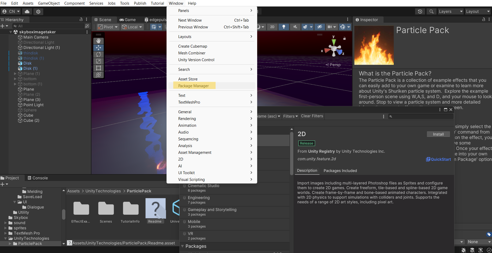
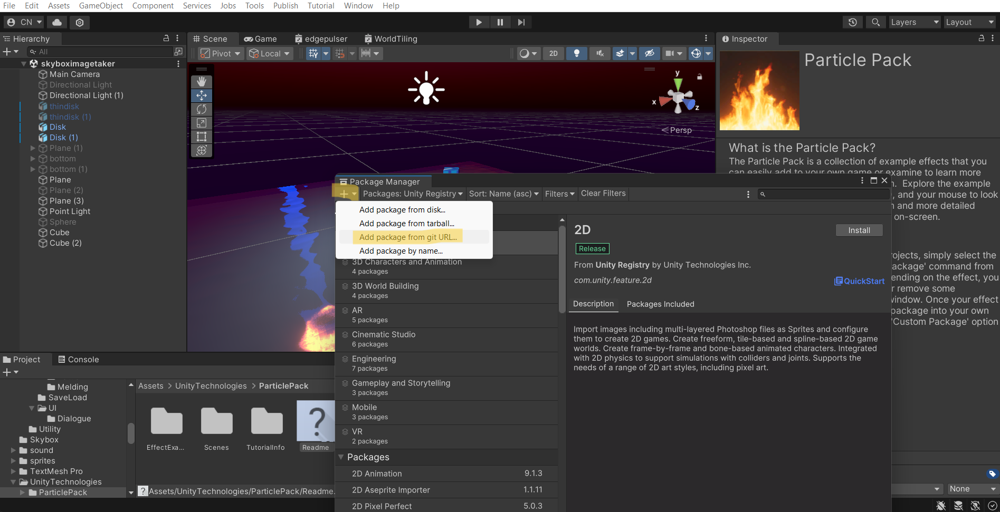

[Home](../../../index.md) / [Game Development](../index.md) / [Packages](packages.md) /

# How To Import the Packages

This page contains a guide on how to import the packages into your own unity project using the git url.

## Step 1

The first step is to open the package manager, which is available from the window tab in the top bar.



### Step 2

Once the package manager is open, press on the plus button at the top left of the menu, then select

```
Add package from git URL
```




### Step 3

Paste the git url into the popup menu. Note that the url needs to end with .git, for example:

> **this will fail:** https://github.com/claynimmo/Unity-Editor-Tools-Package

> **this will import correctly:** https://github.com/claynimmo/Unity-Editor-Tools-Package.git

Alternatively, you can import from disk if you have access to a ***.unitypackage*** file.