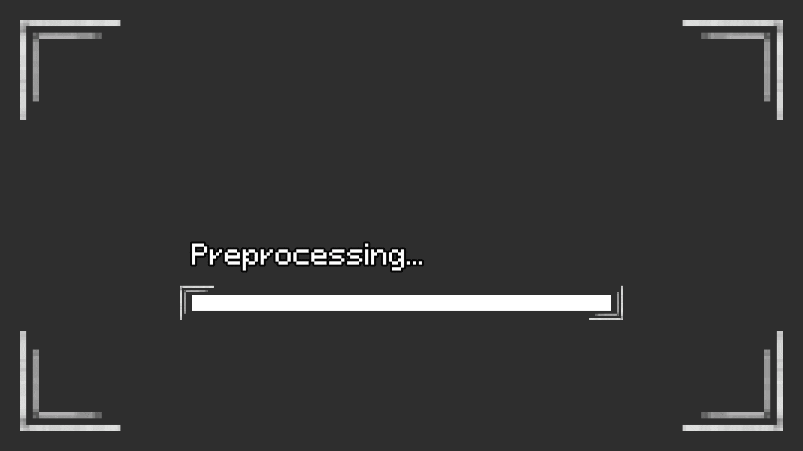

[Home](../../../../index.md) / [Smaller Projects](../index.md) /

# Dungeon Generation
This code is the unity scripts used to procedurally generate a dungeon inside a grid structure. This file is longer, since there are several dependency scripts that must also be included here. The main important scripts are the main generation, and the hallway generation.



## Main generation code
```csharp
using System.Collections;
using System.Collections.Generic;
using System.Threading.Tasks;
using UnityEngine;

public class MapGenerator : MonoBehaviour
{

    [SerializeField] private GameObject[] roomPrefs;

    [SerializeField] private int maxRooms;
    [SerializeField] private int currentRooms = 0;

    public Grid<GridCell> grid;

    [System.Serializable]
    public class Hallway{
        public GameObject[] straight;
        public GameObject[] corner;
        public GameObject[] tripple;
        public GameObject[] quad;
        public AreaType type; //this is not used, it is only for the editor in knowing what each field is for
    }

    [SerializeField] private Hallway[] hallways; //array should be in order of areatype, and be equal in length to the amount of areas

    [SerializeField] private GameObject startRoom;

    [SerializeField] private List<List<GridCell>> doorCells = new();
    

    [SerializeField] private MapDrawer drawer;
    [SerializeField] private MapDrawer userDrawer;


    public int cellSize = 20;

    [SerializeField] private int tries = 50;

    private bool valid = false;
    private bool invalidRoom = false;

    private int spawnX;
    private int spawnY;

    public BiomeGeneration biomes;
    public HomeManager spawnPoint;

    [SerializeField] private LoadingMapScreen loadScreen;
    [SerializeField] private float biomeGenLoadAmount = 0.1f;
    [SerializeField] private float roomGenLoadAmount = 0.45f;
    [SerializeField] private float hallwayLoadAmount = 0.55f;
    void Awake(){
        grid = new Grid<GridCell>(drawer.cellWidth, drawer.cellHeight, cellSize, transform.position, (grid, x, y) => new GridCell((short)x, (short)y));

        SetSpawn();
        StartCoroutine(DelayedStart());
    }

    IEnumerator DelayedStart(){
        yield return new WaitForSeconds(0.1f);
        drawer.SetStart(spawnX, spawnY);
        userDrawer.SetStart(spawnX, spawnY);
        StartCoroutine(GenerateBiome());
    }

    public (int, int, int, Grid<GridCell>) GetGrid(){
        return (drawer.cellWidth, drawer.cellHeight, cellSize, grid);
    }

    private void SetSpawn(){

        GridCell startCell = null;

        //set the starting room position
        while(startCell == null){
            spawnX = Random.Range(0, drawer.cellWidth - 5);
            spawnY = Random.Range(1, drawer.cellHeight - 2);
            startCell = grid.GetValue(spawnX, spawnY);
        }
        startCell.isDoor = true;
        startCell.isHome = true;
        startRoom.transform.position = new Vector3(spawnX * cellSize, 0 ,spawnY * cellSize);

        //set neighboring cells to blank, to discourage generating other objects there
        List<GridCell> neighbors = AStar.GetNeighbors(grid, startCell, startCell);
        foreach(GridCell cell in neighbors){
            if(cell == null) continue;
            cell.isBlank = true;
        }

        doorCells.Add(new(){startCell});
    }

    IEnumerator GenerateBiome(){
        WaitForEndOfFrame frame = new();
        biomes.GenerateBiome(grid,grid.width, grid.height, spawnX, spawnY);
        yield return frame;
        loadScreen.IncreaseBar(biomeGenLoadAmount);
        StartCoroutine(GenerateRoom());
    }

    IEnumerator GenerateRoom(){

        yield return StartCoroutine(loadScreen.SetText("Spawning Rooms..."));
        WaitForEndOfFrame frame = new();

        //try spawning rooms on loop, up to a specified number of attempts
        for(int i = 0; i < tries; i++){
            if(currentRooms == maxRooms) break; //break out of the loop once everything is generated
            currentRooms ++;
            valid = false;

            int randomX = Random.Range(0, drawer.cellWidth);
            int randomY = Random.Range(0, drawer.cellHeight);
            int randomRoom = Random.Range(0, roomPrefs.Length);
            int rot = Random.Range(0,4);
            //initialize the room
            GameObject room = Instantiate(roomPrefs[randomRoom]);
            room.transform.rotation = Quaternion.Euler( new Vector3(0,90*rot,0));
            room.transform.position = new Vector3(randomX * cellSize, 0, randomY * cellSize);
            IGenerate roomData = room.GetComponent<IGenerate>();
            
            roomData.SetGenerator(this, drawer);
            roomData.Generate();
            //wait until the room has finished generating. This is done when the InvalidRoom or RoomGenerated function is called from IGenerate
            do{
                yield return frame;
            } while(!valid);

            if(invalidRoom) continue;


            invalidRoom = false;
            
            loadScreen.IncreaseBar(roomGenLoadAmount/maxRooms);

            List<Vector2Int> doorPos = roomData.GetCells();
            List<GridCell> cells = new();

            //get a list of all cells that are doors, and add this list object to a second order list representing the doors per room
            foreach(Vector2Int vec in doorPos){
                GridCell cell = grid.GetValue(vec.x, vec.y);
                if(cell == null){continue;}
                cells.Add(cell);
            }
            if(cells.Count > 0)
                doorCells.Add(cells);
        }

        //proceed to hallway generation
        StartCoroutine(GenerateHallways());
    }

    IEnumerator GenerateHallways(){
        
        WaitForEndOfFrame frame = new();

        //loop through every room's doors, so each doorway is guaranteed to have a 
        for(int i = 0; i < doorCells.Count; i++){

            if(doorCells[i].Count == 0) continue; //edge case for empty lists

            //loop through every individual door per room
            for(int j = 0; j < doorCells[i].Count; j++){
                int randI, randJ;

                //get random door values, guaranteeing that it does not select itself
                do {
                    randI = Random.Range(0, doorCells.Count);
                    randJ = Random.Range(0, doorCells[randI].Count);
                } while (randI == i && randJ == j);

                List<GridCell> path = HallwayGeneration.FindPath(grid, doorCells[i][j], doorCells[randI][randJ]);

                //update the data in gridcells for when the objects are instantiated
                foreach(GridCell cell in path){
                    if(cell == null || cell.isHallway || cell.isHome || cell.used) continue;
                    cell.isHallway = true;

                    //update the meta-data for all hallway cells, and their neighbors
                    HallwayGrid(cell);
                    HallwayGrid(grid.GetValue(cell.x+1, cell.y));
                    HallwayGrid(grid.GetValue(cell.x-1, cell.y));
                    HallwayGrid(grid.GetValue(cell.x, cell.y+1));
                    HallwayGrid(grid.GetValue(cell.x, cell.y-1));
                    yield return frame;
                }
            }
        }

        //continue to spawning hallways
        StartCoroutine(SpawnHallways());
    }

    //sets the meta data for hallways
    private void HallwayGrid(GridCell cell){
        if(cell == null)    return;
        if(!cell.isHallway) return;


        GridCell left = grid.GetValue(cell.x - 1, cell.y);
        GridCell right = grid.GetValue(cell.x + 1, cell.y);
        GridCell up = grid.GetValue(cell.x, cell.y + 1);
        GridCell down = grid.GetValue(cell.x, cell.y - 1);

        bool hasLeft = left != null && (left.used || left.isHallway || left.isHome);
        bool hasRight = right != null && (right.used || right.isHallway || right.isHome);
        bool hasUp = up != null && (up.used || up.isHallway || up.isHome);
        bool hasDown = down != null && (down.used || down.isHallway || down.isHome);

        //all four
        if(hasRight && hasLeft && hasDown && hasUp){
            cell.rotation = 0;
            cell.hallwayType = HallwayType.Quad;
        }
        //tripple pointing up
        else if(hasRight && hasLeft && hasUp){
            cell.rotation = 3;
            cell.hallwayType = HallwayType.Tripple;
        }
        //tripple pointing right
        else if(hasRight && hasDown && hasUp){
            cell.rotation = 0;
            cell.hallwayType = HallwayType.Tripple;
        }
        //tripple pointing left
        else if(hasLeft && hasDown && hasUp){
            cell.rotation = 2;
            cell.hallwayType = HallwayType.Tripple;
        }
        //tripple pointing down
        else if(hasRight && hasLeft && hasDown){
            cell.rotation = 1;
            cell.hallwayType = HallwayType.Tripple;
        }
        //turn right moving up
        else if(hasRight && hasDown){
            cell.rotation = 0;
            cell.hallwayType = HallwayType.Corner;
        }
        //turn right moving down
        else if(hasRight && hasUp){
            cell.rotation = 3;
            cell.hallwayType = HallwayType.Corner;
        }
        //turn left moving up
        else if(hasLeft && hasDown){
            cell.rotation = 1;
            cell.hallwayType = HallwayType.Corner;
        }
        //turn left moving down
        else if(hasLeft && hasUp){
            cell.rotation = 2;
            cell.hallwayType = HallwayType.Corner;
        }
        //straight left to right
        else if(hasRight || hasLeft){
            cell.rotation = 1;
            cell.hallwayType = HallwayType.Straight;
        }
        //straight up to down
        else{
            cell.rotation = 0;
            cell.hallwayType = HallwayType.Straight;
        }
    }

    ///this is a coroutine to avoid pausing the entire game when spawning the hallways
    private IEnumerator SpawnHallways(){
        WaitForEndOfFrame frame = new();

        yield return StartCoroutine(loadScreen.SetText("Creating Hallways..."));

        int hallwayCount = 0;
        for (int x = 0; x < grid.width; x++) {
            for (int y = 0; y < grid.height; y++) {
                GridCell cell = grid.GetValue(x, y);
                if(cell == null)   continue;
                if(cell.isHallway) hallwayCount ++;
            }
        }

        for (int x = 0; x < grid.width; x++) {
            for (int y = 0; y < grid.height; y++) {
                GridCell cell = grid.GetValue(x, y);
                if(cell == null)   continue;
                if(!cell.isHallway)continue;
                GameObject spawn;

                Hallway hall = hallways[(int)cell.areaType]; //note for later: update the index to the biome index once the prefabs have been made

                //select the correct prefab to spawn based on the hallway type
                switch(cell.hallwayType){
                    case HallwayType.Quad:
                        spawn = hall.quad[Random.Range(0, hall.quad.Length)];
                        break;
                    case HallwayType.Tripple:
                        spawn = hall.tripple[Random.Range(0, hall.tripple.Length)];
                        break;
                    case HallwayType.Corner:
                        spawn = hall.corner[Random.Range(0, hall.corner.Length)];
                        break;
                    case HallwayType.Straight:
                    default:
                        spawn = hall.straight[Random.Range(0, hall.straight.Length)];
                        break;
                    
                }

                //initialize the hallway
                GameObject spawnedHall = Instantiate(spawn);
                IGenerate generate = spawnedHall.GetComponent<IGenerate>();
                spawnedHall.transform.position = new Vector3(cell.x * cellSize, 0, cell.y * cellSize);
                spawnedHall.transform.rotation = Quaternion.Euler(new Vector3(0, cell.rotation * 90, 0));
                generate.SetGenerator(this, drawer);
                spawnedHall.GetComponent<MapData>().col = cell.areaType;
                generate.Generate();
                
                loadScreen.IncreaseBar(hallwayLoadAmount/hallwayCount);

                yield return frame;
            }
        }

        FinishedGeneration();
        yield return null;
    }

    public void InvalidRoom(GameObject room){
        Destroy(room);
        valid = true;
        invalidRoom = true;
        currentRooms --;
    }

    public void RoomGenerated(){
        valid = true;
        invalidRoom = false;
    }

    public void FinishedGeneration(){
        loadScreen.FinishLoading();
        spawnPoint.Initialize();
        spawnPoint.SetWalls(grid, spawnX, spawnY);
    }
}
```

## Hallway generation code
```csharp
using System.Collections;
using System.Collections.Generic;
using UnityEngine;

public static class HallwayGeneration
{
    //uses the A* pathfinding algorithm to get the points
    public static readonly float hallwayPreference = 0.2f;


    public static List<GridCell> FindPath(Grid<GridCell> grid, GridCell start, GridCell target) {
        return AStar.FindPath(grid, start, target, CalculateCost);
    }

    public static float CalculateCost(GridCell cell){
        float val = 1;
        if(cell.isHallway) //prioritize combining hallways, to reduce clutter
            val = hallwayPreference;
        if(cell.isBlank)
            val = 12f; //discourage touching rooms, except to reach the doorway
        if(cell.isFree)
            val = 0;
        return val;
    }
}
```

## Biome generation code
```csharp
using System.Collections;
using System.Collections.Generic;
using UnityEngine;
using System;
public class BiomeGeneration : MonoBehaviour
{

    //generate biomes with Voronoi
    [SerializeField] private int biomeCount = 5;

    private List<BiomeSeed> GenerateBiomePoints(int gridWidth, int gridHeight, int homeX, int homeY){
        List<BiomeSeed> seeds = new();

        int numBiomes = Enum.GetValues(typeof(AreaType)).Length;

        seeds.Add(new(new(homeX, homeY), AreaType.Default));

        for(int i = 1; i < biomeCount; i++){
            Vector2Int pos = new(
                UnityEngine.Random.Range(0, gridWidth), UnityEngine.Random.Range(0, gridHeight)
            );
            AreaType biome = (AreaType)UnityEngine.Random.Range(0, numBiomes);

            seeds.Add(new(pos, biome));
        }
        return seeds;
    }

    public void GenerateBiome(Grid<GridCell> grid, int gridWidth, int gridHeight, int homeX, int homeY){
        List<BiomeSeed> seeds = GenerateBiomePoints(gridWidth, gridHeight, homeX, homeY);
        for(int i = 0; i < gridWidth; i++){
            for(int j = 0; j < gridHeight; j++){
                Vector2Int cellPos = new(i,j);
                float minDist = float.MaxValue;
                AreaType closestBiome = AreaType.Default;

                foreach(BiomeSeed seed in seeds){
                    float dist = GetDistance(cellPos, seed.position);
                    if(dist < minDist){
                        minDist = dist;
                        closestBiome = seed.biome;
                    }
                }

                GridCell cell = grid.GetValue(i,j);
                if(cell != null)
                    cell.areaType = closestBiome;
            }
        }
    }

    private float GetDistance(Vector2Int pos1, Vector2Int pos2){
        return Mathf.Abs(pos2.x - pos1.x) + Mathf.Abs(pos2.y - pos1.y);
    }
}

public class BiomeSeed{
    public Vector2Int position;
    public AreaType biome;

    public BiomeSeed(Vector2Int pos, AreaType type){
        position = pos;
        biome = type;
    }
}

```

## A* algorithm (used in the hallway generation)

```csharp
using System.Collections;
using System.Collections.Generic;
using UnityEngine;
using System;

public class AStar : MonoBehaviour
{
    public class PathNode {
        public GridCell cell;
        public PathNode parent;
        public float gCost;
        public float hCost;
        public float fCost => gCost + hCost;

        public PathNode(GridCell cell) {
            this.cell = cell;
        }
    }

    static float Heuristic(GridCell a, GridCell b) {
        return Mathf.Abs(a.x - b.x) + Mathf.Abs(a.y - b.y);
    }

    public static List<GridCell> GetNeighbors(Grid<GridCell> grid, GridCell cell, GridCell destination) {
        List<GridCell> neighbors = new List<GridCell>();
        short[,] directions = new short[,] { {0,1}, {1,0}, {0,-1}, {-1,0} };

        for (int i = 0; i < directions.GetLength(0); i++) {

            short nx = (short)(cell.x + directions[i, 0]);
            short ny = (short)(cell.y + directions[i, 1]);

            if(grid.GetValue(nx, ny) != null){ //null check

                GridCell neighbor = grid.GetValue(nx, ny);
                //ignore used tiles
                if(!neighbor.used || neighbor == destination){
                    neighbors.Add(neighbor);
                }
            }
        }
        return neighbors;
    }

    public static List<GridCell> FindPath(Grid<GridCell> grid, GridCell start, GridCell target, Func<GridCell, float> Cost) {
        if(start == null || target == null){return new();}
        var openSet = new List<PathNode>();
        var closedSet = new HashSet<GridCell>();
        var nodeMap = new Dictionary<GridCell, PathNode>();

        PathNode startNode = new PathNode(start){ gCost = 0, hCost = Heuristic(start, target) };
        openSet.Add(startNode);
        nodeMap[start] = startNode;

        while (openSet.Count > 0) {
            openSet.Sort((a, b) => a.fCost.CompareTo(b.fCost));
            PathNode current = openSet[0];
            openSet.RemoveAt(0);

            if (current.cell == target)
                return ReconstructPath(current);

            closedSet.Add(current.cell);

            //check every neighbor
            foreach(var neighborCell in GetNeighbors(grid, current.cell, target)) {
                if(closedSet.Contains(neighborCell)) continue; //skip already calculated neighbors

                float cost = Cost(neighborCell);
                if(cost == -1){continue;} // skip certain nodes when its cost is -1

                float tentativeG = current.gCost + cost; //uniform cost for nodes

                if(!nodeMap.TryGetValue(neighborCell, out var neighborNode)) {
    neighborNode = new PathNode(neighborCell) {
        gCost = float.MaxValue
    };
    nodeMap[neighborCell] = neighborNode;
}

                if(tentativeG < neighborNode.gCost || !openSet.Contains(neighborNode)){
                    neighborNode.gCost = tentativeG;
                    neighborNode.hCost = Heuristic(neighborCell, target);
                    neighborNode.parent = current;

                    if(!openSet.Contains(neighborNode))
                        openSet.Add(neighborNode);
                }
            }
        }

        return new(); // no path found
    }

    public static List<GridCell> ReconstructPath(PathNode endNode) {
        var path = new List<GridCell>();
        PathNode current = endNode;
        while (current != null) {
            path.Add(current.cell);
            current = current.parent;
        }
        path.Reverse();

        if(path.Count >= 2)
            path.RemoveAt(0); //remove start
        return path;
    }
}
```

## Additional classes
```csharp
using UnityEngine;

public class GridCell{
    public AreaType areaType;
    public AreaType overlayType;
    public Sprite sprite;
    public Sprite overlay;
    public byte rotation; // store the image rotation. represents pi * rotation / 2

    public short x;
    public short y;

    public bool isDoor;
    public bool used;
    public bool isHallway;
    public bool isBlank;
    public bool isFree;
    public bool isHome;

    public HallwayType hallwayType;

    public GridCell(short x, short y){
        this.x = x;
        this.y = y;
    }
}
```

```csharp
using System.Collections;
using System.Collections.Generic;
using UnityEngine;

public interface IGenerate{
    public void SetGenerator(MapGenerator generator, MapDrawer drawer);
    public void Generate();
    public List<Vector2Int> GetCells();
}
```

```csharp
using System.Collections;
using System.Collections.Generic;
using UnityEngine;

public class RoomData : MonoBehaviour, IGenerate
{   
    //room origin (0,0) is bottom left
    [System.Serializable]
    public class Room{
        public Sprite overlaySprite;
        public AreaType overlayCol;
        public bool isDoor;
        public Vector2Int outsideDirection;
        public bool ignore = false;
    }

    [System.Serializable]
    public class RoomRow {
        public Room[] row; //since the grid starts bottom left, the rows are bottom up, so the very first item of the first row is the bottom left cell
    }


    [SerializeField] private List<Vector2Int> doorPos;

    [SerializeField] private AreaType color;

    [SerializeField] private RoomRow[] rooms;

    [SerializeField] private MapDrawer drawer;


    [SerializeField] private MapGenerator generator;

    [SerializeField] private int cellSize = 20;

    [SerializeField] private byte rot;

    [Header("INTIALIZE THE ROOM ARRAY")]
    [SerializeField] private bool initializeRoom; //toggling this activates the InitializeRoom() function, through the RoomInitializer editor class


    [Header("ROOM DATA")]
    [SerializeField] private int rows = 1;
    [SerializeField] private int columns = 1;
    [SerializeField] private Sprite defaultOverlay;
    [SerializeField] private AreaType defaultOverlayType;


    public void InitializeRoom(){
        rooms = new RoomRow[rows];
        for(int i = 0; i < rooms.Length; i++){
            rooms[i] = new RoomRow();
            rooms[i].row = new Room[columns];
            for(int j = 0; j < rooms[i].row.Length; j++){
                rooms[i].row[j] = new Room();
                rooms[i].row[j].overlaySprite = defaultOverlay;
                rooms[i].row[j].overlayCol = defaultOverlayType;
            }
        }
    }

    public List<Vector2Int> GetCells(){
        return doorPos;
    }

    public void Generate(){
        rot = (byte)((transform.rotation.eulerAngles.y / 90) % 4);
        bool invalid = false;

        
        Vector2Int anchorGrid = new Vector2Int(
            Mathf.FloorToInt(transform.position.x / cellSize),
            Mathf.FloorToInt(transform.position.z / cellSize)
        );

        int rows = rooms.Length;
        //check if the room is invalid first
        for(int row = -1; row < rooms.Length + 1; row++){
            for(int col = -1; col < rooms[0].row.Length + 1; col++){

                if(row >= 0 && row < rows && col >= 0 && col < rooms[0].row.Length){
                    if (rooms[row].row[col].ignore)
                        continue;
                }
                
                Vector2Int offset = RotateOffset(col, row, rot);

                Vector2Int gridPos = anchorGrid + offset;

                GridCell cell = generator.grid.GetValue(gridPos.x, gridPos.y);

                if(cell == null || cell.used || cell.isBlank){
                    invalid = true;
                }
            }
        }

        if(invalid){generator.InvalidRoom(gameObject); return;}
        //apply the room data if it is valid
        for(int row = 0; row < rooms.Length; row++){
            for(int col = 0; col < rooms[row].row.Length; col++){
                Room room = rooms[row].row[col];
                if(room.ignore)
                    continue;
                
                Vector2Int offset = RotateOffset(col, row, rot);
                Vector2Int gridPos = anchorGrid + offset;

                GridCell cell = generator.grid.GetValue(gridPos.x, gridPos.y);
                if(cell == null){continue;}


                cell.areaType = color;
                cell.overlayType = room.overlayCol;
                cell.isDoor = room.isDoor;
                cell.used = true;

                if(cell.isDoor){
                    Vector2Int rotatedDir = RotateOffset(room.outsideDirection.x, room.outsideDirection.y, rot);
                    Vector2Int p = new(rotatedDir.x + cell.x, rotatedDir.y + cell.y);
                    GridCell outside = generator.grid.GetValue(p.x, p.y);
                    if(outside != null){
                        if(outside.used) continue;
                        outside.used = false;
                        outside.isBlank = true;
                        outside.isHallway = true;
                        doorPos.Add(p);
                        drawer.UpdateCellRoom(
                            
                            rooms[row].row[col].overlaySprite, 
                          
                            Brush.AreaColor(color),
                            Brush.AreaColor(rooms[row].row[col].overlayCol),
                            (short)outside.x,
                            (short)outside.y);
                    }
                }

                drawer.UpdateCellRoom(
                    
                    rooms[row].row[col].overlaySprite, 
                   
                    Brush.AreaColor(color),
                    Brush.AreaColor(rooms[row].row[col].overlayCol),
                    (short)gridPos.x,
                    (short)gridPos.y);
            }
        }

        //apply padding
        for (int row = -1; row <= rooms.Length; row++) {
            for (int col = -1; col <= rooms[0].row.Length; col++) {
                // Skip actual room cells
                if (row >= 0 && row < rooms.Length && col >= 0 && col < rooms[0].row.Length)
                    if (!rooms[row].row[col].ignore)
                        continue;

                Vector2Int offset = RotateOffset(col, row, rot);
                Vector2Int gridPos = anchorGrid + offset;

                GridCell cell = generator.grid.GetValue(gridPos.x, gridPos.y);
                if (cell != null && !cell.used && !cell.isFree)
                    cell.isBlank = true;
            }
        }

        generator.RoomGenerated();

        Destroy(this);
    }

    Vector2Int RotateOffset(int col, int row, int rot) {
        switch (rot % 4) {
            case 0: return new Vector2Int(col, row);          // 0
            case 1: return new Vector2Int(row, -col);         // 90
            case 2: return new Vector2Int(-col, -row);        // 180
            case 3: return new Vector2Int(-row, col);         // 270
            default: return new Vector2Int(col, row);
        }
    }

    public void SetGenerator(MapGenerator generator, MapDrawer drawer){
        this.generator = generator;
        this.drawer = drawer;
    }

}
```